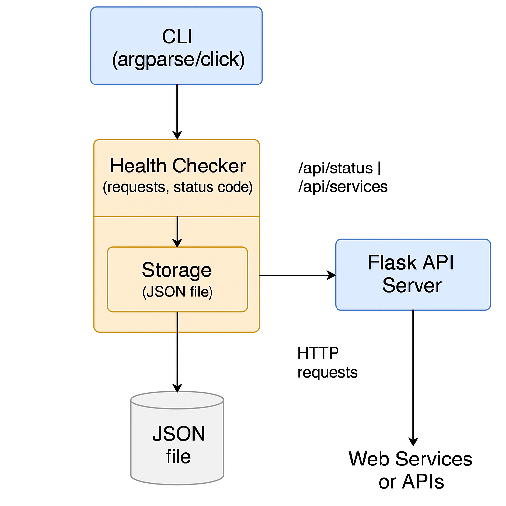

# DevOps Health Check Dashboard



A **production-ready** monitoring solution for DevOps teams to track service health statuses with ease and reliability.

## Features

- **Backend Services**:
  - REST API for managing monitored services
  - Background health check scheduler
  - JSON storage (with file locking)
  - Docker-ready implementation
  - Comprehensive logging

- **Frontend Dashboard**:
  - Real-time service status monitoring
  - Interactive web interface
  - Add/remove services via UI
  - Automatic refresh every 30 seconds
  - Visual status indicators (UP/DOWN)
  - Responsive design

- **CI/CD with GitHub Actions**:
  This project uses GitHub Actions for continuous integration (CI) and continuous deployment (CD). The CI/CD pipeline automates the process of building, testing, and deploying the application.
  The CI pipeline is defined in `.github/workflows/ci-cd.yml`. You can find further documentation in `.github/workflows/readme.md`.

*\[Detailed UI documentation available in `ui/README.md`\]*

---

## Quick Start

### Local Development (Backend Only)

```bash
python -m venv venv
source venv/bin/activate  # Linux/Mac
venv\Scripts\activate    # Windows

pip install -r requirements.txt
python -m app.run
```

---

### Docker Deployment: Full System (Backend + Frontend)

```bash
docker-compose -f docker-compose.base.yml -f docker-compose.override.yml up --build
```

**How to Access Your Application:**

- Frontend Dashboard: [http://localhost](http://localhost)
- Backend API Direct Access: [http://localhost:5000/health](http://localhost:5000/health)
- Through Nginx Proxy: [http://localhost/api/health](http://localhost/api/health)

---

## API Documentation

### Endpoints

| Endpoint                | Method | Description                      |
|-------------------------|--------|----------------------------------|
| `/health`               | GET    | Get current health status        |
| `/services`             | POST   | Add new service                  |
| `/services/<name>`      | DELETE | Remove service                   |

### CLI Usage

```bash
# List services
python cli.py list

# Add service
python cli.py add "Service Name" "http://service.url"
```

### CURL Usage (Windows Style Example)

```bash
# Add service
curl -X POST http://localhost:5000/services \
     -H "Content-Type: application/json" \
     -d '{"name": "Facebook", "url": "https://www.facebook.com/"}'

# Remove service
curl -X DELETE http://localhost:5000/services/Facebook
```

---

## Configuration

Environment variables (in `.env` file):

```bash
FLASK_ENV=production
CHECK_INTERVAL=60
IN_DOCKER=0
```

---

## Testing

Run unit tests:

```bash
pytest tests/
```

---

## Directory Structure

```bash
devops-health-check-dashboard/
├── .github/
│   └── workflows/
│       └── ci-cd.yml          # CI/CD pipeline
├── docker/
│   ├── dev/
│   │   ├── Dockerfile         # Dev Dockerfile
│   │   └── docker-compose.yml # Dev Compose
│   └── prod/
│       ├── Dockerfile         # Prod Dockerfile
│       └── docker-compose.yml # Prod Compose
├── scripts/
│   ├── deploy.sh              # Production deployment
│   ├── test-local.sh          # Local test script
│   └── healthcheck.sh         # Custom health checks
├── app/
│   ├── __init__.py
│   ├── checker.py             # Core health check logic
│   ├── storage.py             # Read/write JSON storage
│   ├── config.py              # Load environment configuration
│   ├── api.py                 # Flask API routes
│   └── scheduler.py           # Periodic background checker
├── cli.py                     # CLI entrypoint
├── run.py                     # Starts Flask app
├── requirements.txt
├── .env
├── .gitignore
├── README.md
└── diagrams/
    └── architecture.png
├── ui/                        # Frontend code
│   ├── public/                # Static assets
│   ├── src/                   # React source code
│   │   ├── components/        # Reusable components
│   │   ├── pages/             # Page components
│   │   ├── services/          # API service layer
│   │   ├── styles/            # CSS/Tailwind configs
│   │   └── App.js             # Main React app entry
│   ├── package.json           # Frontend dependencies
│   ├── Dockerfile             # Frontend Dockerfile
│   └── README.md              # Frontend-specific docs
```

---

## License

This project is licensed under the [MIT License](./LICENSE).

---

## Contributions

We welcome contributions of all types!

- Found a bug? Open an Issue.
- Want a feature? Suggest it or create a Pull Request.
- Improvements, refactors, documentation updates are all welcome!

Please fork the repo, create a branch, and open a Pull Request 🚀

---

## Support

If you find this project helpful, please **Star** ⭐ the repository! It encourages the maintenance and future improvements.

Thank you for visiting! 🙌

Happy Monitoring! 🎯