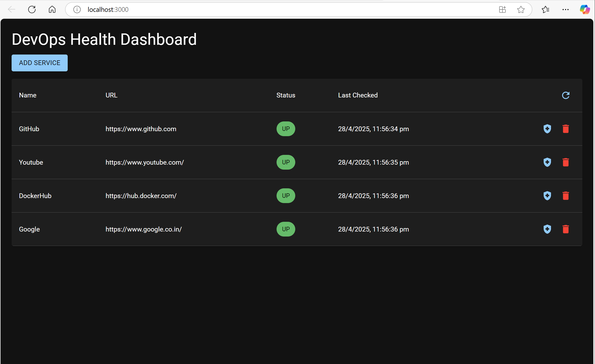

# DevOps Health Dashboard - UI

A React-based frontend for monitoring the status of your services, connecting to the DevOps Health Check backend API.



## Features

- Real-time service status monitoring
- Add/remove services from the dashboard
- Automatic refresh every 30 seconds
- Visual status indicators (UP/DOWN)
- Responsive design
- Dark/Light theme support

## Prerequisites

- Node.js v18 or higher
- npm v9 or higher
- Running instance of the [DevOps Health Check Backend](https://github.com/rupesh40/DevOps-Health-Check-Dashboard)

## Installation

1. Clone the repository (if you haven't already):
```bash
   git clone https://github.com/rupesh40/DevOps-Health-Check-Dashboard.git
   cd DevOps-Health-Check-Dashboard/ui
```

2. Install dependencies:
```bash
npm install
```
3. Create environment configuration:
```bash
echo "REACT_APP_API_URL=http://localhost:5000" > .env
```

## Available Scripts

In the project directory, you can run:

### `npm start`

Runs the app in development mode.\
Open [http://localhost:3000](http://localhost:3000) to view it in your browser.

The page will reload when you make changes.\
You may also see any lint errors in the console.

### `npm test`

Launches the test runner in interactive watch mode.

### `npm run build`

Builds the app for production to the `build` folder.\
It correctly bundles React in production mode and optimizes the build for the best performance.

### `npm run eject`

**Note: this is a one-way operation. Once you eject, you can't go back!**

If you aren't satisfied with the build tool and configuration choices, you can `eject` at any time. This command will remove the single build dependency from your project.

## Environment Variables

You can configure the following environment variables:

- `REACT_APP_API_URL`: The base URL of your backend API (default: `http://localhost:5000`)

## Connecting to Backend
Ensure your backend is running and accessible at the URL specified in your .env file. By default, it expects the backend at http://localhost:5000.

## Project Structure
ui/
├── public/              # Static files
├── src/
│   ├── components/      # Reusable components
│   ├── pages/           # Page components
│   ├── services/        # API service modules
│   ├── styles/          # Global styles
│   ├── App.tsx          # Main app component
│   └── index.tsx        # Entry point
├── .env                 # Environment variables
├── Dockerfile           # Production Docker configuration
└── nginx.conf           # Nginx configuration

## Troubleshooting
CORS Errors
If you see CORS errors:

Ensure your backend is running
Verify the REACT_APP_API_URL in your .env file is correct

Consider adding CORS support to your Flask backend

## Contributing
Pull requests are welcome. For major changes, please open an issue first to discuss what you would like to change.